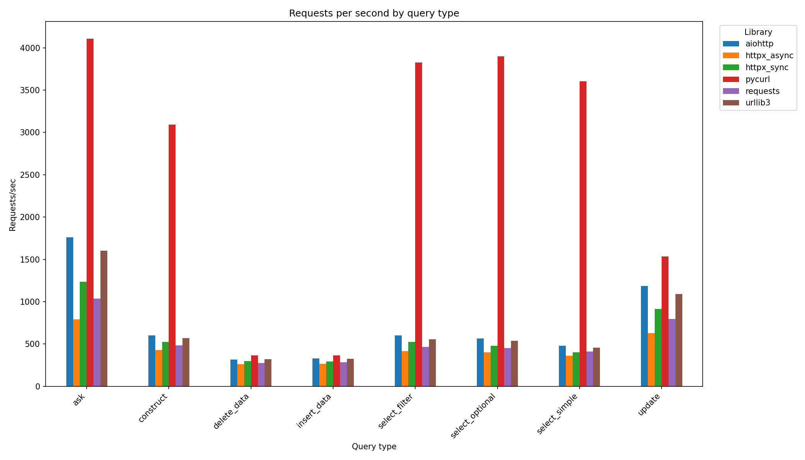
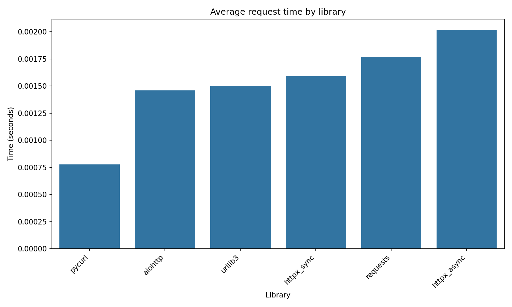
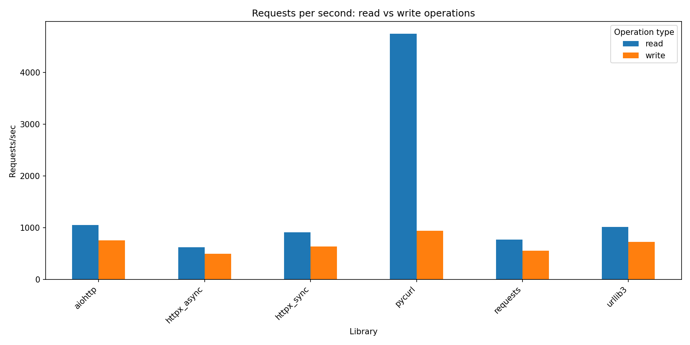
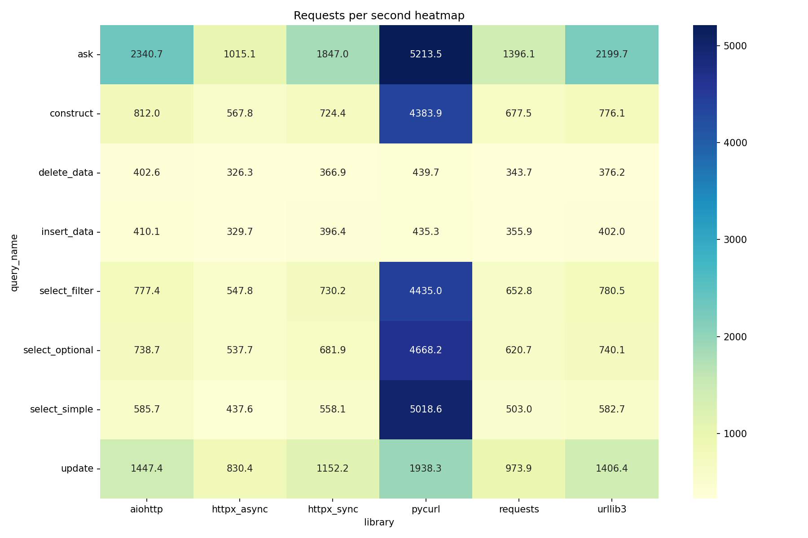

# SPARQL HTTP Benchmark

Benchmark for comparing Python HTTP libraries on SPARQL 1.1 operations against a Virtuoso endpoint.

## Libraries tested

- **httpx** (sync and async)
- **aiohttp** (async)
- **requests** (sync)
- **urllib3** (sync)
- **pycurl** (sync)

## SPARQL operations

### Read operations
- SELECT (simple, with FILTER, with OPTIONAL)
- ASK
- CONSTRUCT

### Write operations
- INSERT DATA
- DELETE DATA
- DELETE/INSERT (UPDATE)

## Requirements

- Python 3.12+
- Docker (for Virtuoso)

## Installation

```bash
uv sync
```

## Usage

Run the complete benchmark (launches Virtuoso automatically):

```bash
uv run python benchmark.py
```

## Configuration

Edit constants in `benchmark.py`:

- `NUM_RUNS`: Number of benchmark runs (default: 11, first is warmup)
- `ITERATIONS_PER_QUERY`: Requests per query type (default: 50)

Edit constants in `setup_virtuoso.py`:

- `HTTP_PORT`: Virtuoso SPARQL endpoint port (default: 8090)
- `MEMORY`: Container memory limit (default: 4g)

## Fairness

All libraries are configured with equivalent settings:

| Library | Connection pooling | Timeout |
|---------|-------------------|---------|
| httpx | `Client()` / `AsyncClient()` | 30s |
| aiohttp | `ClientSession()` | 30s |
| requests | `Session()` | 5s connect, 25s read |
| urllib3 | `PoolManager()` | 5s connect, 25s read |
| pycurl | Reused `Curl()` object | 30s |

## Output

- `benchmark_results.csv`: Raw benchmark data
- `rps_by_query.png`: Requests/sec by query type
- `avg_time_by_library.png`: Average request time by library
- `rps_read_vs_write.png`: Read vs write performance
- `rps_heatmap.png`: Performance heatmap

## Results

### Overall ranking (by average request time)

| Rank | Library | Avg time (ms) |
|------|---------|---------------|
| 1 | pycurl | 0.78 |
| 2 | aiohttp | 1.45 |
| 3 | urllib3 | 1.50 |
| 4 | httpx (sync) | 1.61 |
| 5 | requests | 1.78 |
| 6 | httpx (async) | 2.02 |

### Read operations (requests/sec)

| Library | ASK | SELECT simple | SELECT filter | SELECT optional | CONSTRUCT |
|---------|-----|---------------|---------------|-----------------|-----------|
| pycurl | 5214 | 5019 | 4435 | 4668 | 4384 |
| aiohttp | 2341 | 586 | 777 | 739 | 812 |
| urllib3 | 2200 | 583 | 781 | 740 | 776 |
| httpx (sync) | 1847 | 558 | 730 | 682 | 724 |
| requests | 1396 | 503 | 653 | 621 | 678 |
| httpx (async) | 1015 | 438 | 548 | 538 | 568 |

### Write operations (requests/sec)

| Library | INSERT | DELETE | UPDATE |
|---------|--------|--------|--------|
| pycurl | 435 | 440 | 1938 |
| aiohttp | 410 | 403 | 1447 |
| urllib3 | 402 | 376 | 1406 |
| httpx (sync) | 396 | 367 | 1152 |
| requests | 356 | 344 | 974 |
| httpx (async) | 330 | 327 | 830 |

### Key findings

**pycurl dominates read operations**: pycurl achieves 5000+ requests/sec on simple queries, 5-6x faster than any other library. This is due to libcurl's highly optimized C implementation and minimal Python overhead.

**Write performance is more uniform**: All libraries converge to similar performance on write operations (INSERT/DELETE around 350-440 req/s). This indicates the bottleneck shifts to Virtuoso's write path rather than HTTP client overhead.

**Async libraries underperform in sequential benchmarks**: httpx async is the slowest library in this benchmark. Without concurrent requests, async overhead (event loop, coroutine scheduling) adds latency without benefits. aiohttp performs better due to its more optimized implementation.

**urllib3 outperforms requests**: Despite requests being built on urllib3, the additional abstraction layer adds measurable overhead (~15-20% slower).

**httpx sync vs async**: The synchronous httpx client is significantly faster than its async counterpart in sequential workloads, suggesting async should only be used when actual concurrency is needed.

### Charts







